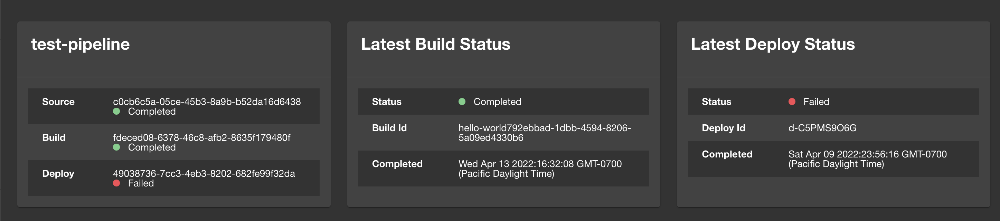
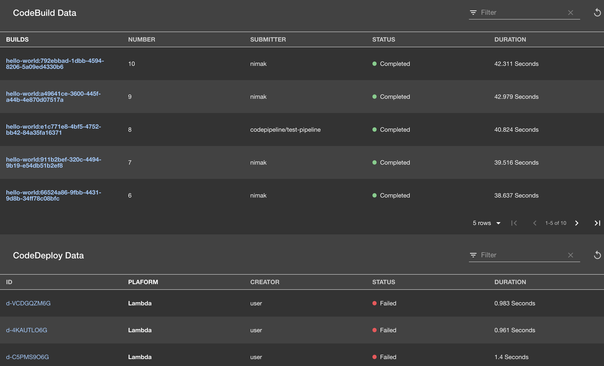

# AWS CodeStar Plugins for Backstage

[](https://github.com/awslabs/aws-codestar-plugins-for-backstage/actions/workflows/ci.yml)

The plugin adds latest status cards as well as expanded history for CI/CD runs of your `AWS Code*` services to your Backstage deployment including:
- AWS CodeBuild
- AWS CodePipeline
- AWS CodeDeploy

You can track the status of your application's build, deploy, and pipelines in `AWS Code*`. Through the selection of which annotations you want to add to your component, you can also customize which views you would like to get in your integration with Backstage.

Card Views:


Tab Views:


## Configuring

### Backstage Setup

- This plugin uses the [AWS
  Auth plugin](https://github.com/RoadieHQ/roadie-backstage-plugins/tree/main/plugins/backend/backstage-plugin-aws-auth) from RoadieHQ to
  enable access to AWS resources via the frontend plugin. Follow the
  configuration steps as describe on the AWS Auth plugin page to enable it for your
  backstage deployment. _Note: it is extermely important to limit the access of
  the role you supply to the AWS Auth plugin to the minimum set of required
  resources. Do not use an admin role, even for testing reasons._

- Update your `packages/app/src/components/catalog/EntityPage.tsx` with
information about the Plugin Card.

- Import the card at the top of the `EntityPage.tsx` file, where other
imports are located.

```tsx
import {
  CodeStarCards,
  EntityCodeStarContent,
  isCodeStarAvailable
} from 'plugin-backstage-code-star';
```

- Find the section for `cicdContent` in the `EntityPage.tsx` file and add the
  following snippet:

```tsx
const cicdContent = (
   <EntitySwitch>
        <EntitySwitch.Case if={isCodeStarAvailable}>
          <EntityCodeStarContent/>
        </EntitySwitch.Case>
  </EntitySwitch>
);
```

- Find the section for `cicdCard` in the `EntityPage.tsx` file. If it does not exist, find `errorContnet`
in the page and add the snippet below, right above it.

```tsx
...
const cicdCard = (
   <EntitySwitch>
        <EntitySwitch.Case if={isCodeStarAvailable}>
          <CodeStarCards variant="gridItem"/>
        </EntitySwitch.Case>
  </EntitySwitch>
);
```

### Configuring the Components

For the plugin to be enabled for your component, you need a mix of the required
annotations and at least one of the optional set of annotations:

**Required Annotations**

```yaml
metadata:
  annotations:
    aws.amazon.com/iam-role-arn: [YOUR_ACCOUNT]
```

**Optional Annotations**

You can enable a subset or all of the following components:
- to integrate with AWS CodeBuild:
```yaml
metadata:
  annotations:
    aws.amazon.com/build-project-arn: [YOUR_BUILD_PROJECT_ARN]
```
- to integrate with AWS CodeDeploy:
```yaml
metadata:
  annotations:
    aws.amazon.com/deploy-group-arn: [YOUR_APPLICATION_DEPLOY_GROUP_ARN]
```
- to integrate with AWS CodePipeline:
```yaml
metadata:
  annotations:
    aws.amazon.com/pipeline-arn: [YOUR_PIPELINE_ARN]
```

## Dev Environment Setup

- Install [Local Package Publisher](https://www.npmjs.com/package/local-package-publisher)
- node version v14.3.0+
- npm version 6.14.4+

Build the plugin by running the following:

```bash
> yarn build # builds your plugin
> ./hack/build.sh # publishes the plugin to a local tmp folder on your machine
```

Modify `package.json` in Backstage, and add the following snippet under
`devDependencies`:

```
"plugin-backstage-code-star": "file:[YOUR_LOCAL_NPM_PACKAGE_FOR_THE_PLUGIN]",
```

- the value for the local plugin NPM package should be extracted from running
`./hack/build.sh` in the plugin folder. The package is usually published to a
folder under `/var/...`, if you are Mac user.


- Run `yarn install` for the plugin in your Backstage core app.

- If your setup is correct, your yarn.lock file should have the snippet for the
  plugin populated for it similar to the following:

```
"plugin-backstage-code-star@file:../../../../../var/folders/t1/kjjzqg156hn0s9yjf3gyvkmd86_67y/T/tmp-58393U5qA7OWKn1PU":
  version "0.0.1"
  dependencies:
    "@backstage/catalog-model" "^0.9.0"
    "@backstage/core-components" "^0.3.0"
    "@backstage/core-plugin-api" "^0.1.5"
    "@backstage/plugin-catalog-react" "^0.4.1"
    "@backstage/theme" "^0.2.9"
    "@material-ui/core" "^4.12.2"
    "@material-ui/icons" "^4.9.1"
    "@material-ui/lab" "4.0.0-alpha.45"
    luxon "^1.28.0"
    react "^16.13.1"
    react-dom "^16.13.1"
    react-router "6.0.0-beta.0"
    react-router-dom "6.0.0-beta.0"
    react-use "^17.2.4"
```

- At this point, you should be able to run `yarn dev` and the compilation of the
  plugin should succeed.

- Add a sample backstage component:
  - Navigate to the `Components` tab in backstage
  - click `Create Component`
  - click `Register Existing Component`
  - for the URL, use a test component URL
  - click `Analyze`
  - then `Import`
  - if successful, you will see the link for the imported component
  - Click on it and should navigate you to the first page of the component, with
    the card from the plugin popping up.

## Security

See [CONTRIBUTING](CONTRIBUTING.md#security-issue-notifications) for more information.

## License

This project is licensed under the Apache-2.0 License.

## Acknowledgement

This plugin started as a hackathon project in an effort initiated by the following
folks: Abel Cruz, Bridget Conncanon, Gregory Fina, Nitu Parimi, Siva
Guruvareddiar, and Nima Kaviani.


