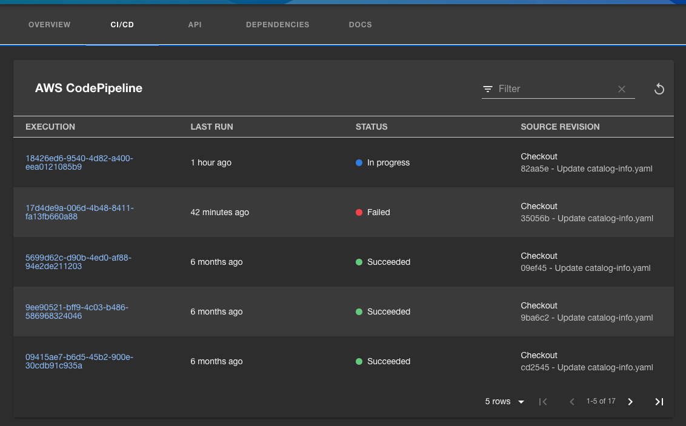

# AWS Code Services backend plugin for Backstage

This frontend UI plugin for Backstage adds functionality to interact with AWS Code Services services such as [AWS CodePipeline](https://aws.amazon.com/codepipeline/), [AWS CodeBuild](https://aws.amazon.com/codebuild/) and [AWS CodeDeploy](https://aws.amazon.com/codedeploy/).

- A scaffolder action to create an AWS Code Services service.

## Installation

See the [AWS Code Services plugins for Backstage installation guide](../../docs/install.md).

## Usage

For information about using this plugin, see the following documents:

- [AWS Code Services plugins for Backstage reference](../../docs/reference.md)

## Development

For information about developing this plugin locally, see [Developing the AWS Code Services plugins for Backstage](../../docs/developing.md).
