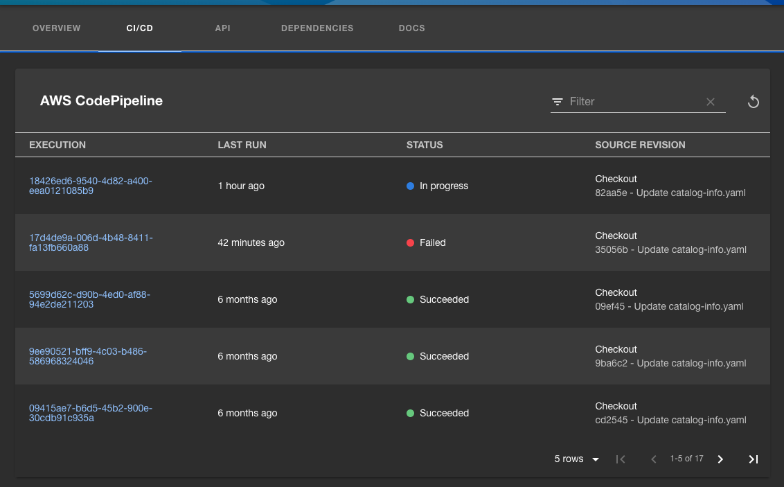

# AWS CodeSuite backend plugin for Backstage

This frontend UI plugin for Backstage adds functionality to interact with AWS CodeSuite services such as [AWS CodePipeline](https://aws.amazon.com/codepipeline/), [AWS CodeBuild](https://aws.amazon.com/codebuild/) and [AWS CodeDeploy](https://aws.amazon.com/codedeploy/).

- A scaffolder action to create an AWS CodeSuite service.

## Installation

See the [AWS CodeSuite plugins for Backstage installation guide](../../docs/install.md).

## Usage

For information about using this plugin, see the following documents:

- [AWS CodeSuite plugins for Backstage reference](../../docs/reference.md)

## Development

For information about developing this plugin locally, see [Developing the AWS CodeSuite plugins for Backstage](../../docs/developing.md).
